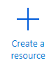

# Docker Configuration: Java Web API in Azure

[Go back to the README...](README.md)

## About this guide

This guide will walk you through the necessary steps to publish a docker image to the Azure Container Container Registry and run the Server (web API) in an App Service Plan in Azure.

**NOTE:** Since the solution includes a webserver application and a client (daemon), it makes sense to run the webserver in Azure and keep the client on your workstation so simulate the scenario of these two application existing in different places.

## Overview

This guide will walk you through the following steps to configure the `serverprototype` application to run in Azure:

- [Preparation](#prepare-your-environment)
- [Configure Azure Container Registry](#azure-container-registry-acr)
- [Docker in Azure](#push-docker-image-to-azure)
- [App Service Plan](#create-an-app-service-plan)

## Prepare your environment

It is highly recommended to test the application locally using Docker on your workstation before deploying it to Azure. The included `Dockerfile` in each module (clientprototype) and (serverprototype) will allow you to create images and containerize each application.

You don't need to containerize the clientprototype if you're simply testing the Client to see if you can obtain a token and authenticate to the web API.

1. Make sure you have [Docker installed (Windows)](https://docs.docker.com/docker-for-windows/install/).

2. Install the [Azure CLI](https://docs.microsoft.com/en-us/cli/azure/install-azure-cli?view=azure-cli-latest)

3. Build the `clientprototype` and `serverprototype` modules

## Azure Container Registry (ACR)

If you do not have an Azure subscription, please sign up for a free trial at [azure.microsoft.com](https://azure.microsoft.com).

1. Sign into your Azure tenant and click on the **Create a resource** link.

    

2. Type "**container**" and choose **Container Registry**.

3. Click the **create** button.

    

4. Type a registry name (i.e. serverprototype).

    **NOTE:** This name will make up the FQDN you will use when you tell Docker to push your custom image to Azure.

    

5. Choose your subscription, resource group, location, and SKU (standard should be sufficient).

6. Be sure to set the **Admin user** to **Enable** as this will allow the App Service Plan we create later to connect to this registry.

## Push Docker image to Azure

This guide assumes you know how to create a Docker image including setting a tag.

1. Open a command window on your workstation where you have the source code and Docker installed.

2. Run the following command and you will have a local image of the `serverprototype` code:

    ```azurecli
    Docker build -t serverprototype .
    ```

3. Log into Azure CLI:

    ```azurecli
    az login
    ```

4. Select the correct account to use (if you have more than one)

    ```azurecli
    az account list
    az account set -s [ssssssss-ssss-ssss-ssss-ssssssssssss]
    ```

5. Log into the Azure Container Registry

    ```azurecli
    az acr login --name [your_registry_fqdn]
    ```

    You should see `Login Succeeded`

6. Create an alias for the `serverprototype` image:

    ```plaintext
    docker tag [your_registry_fqdn]/samples/java/serverprototype
    ```

7. Push the image to ACR:

    ```plaintext
    docker push [your_registry_fqdn]/samples/java/serverprototype
    ```

## Create an App Service Plan

1. Log into your Azure portal and click the **Create a resource** link.

2. Type **web app** and choose the **Web App** option

3. Click the **create** button

    

4. Choose the **resource group**, type a **name** for the website, and choose the **Docker Container** option for the **publish** section.

5. Leave the **operating system** as **Linux** and click the **Create new** option for the **App Service Plan** section.

6. Give the app service plan a new name (i.e. "serverprototype-plan").

7. Select an appropriate SKU/size and click the **Review + create** button.

8. Once your resource has been created, click on the **Overview** section where you will see the URL for your server.

## Testing connectivity from your Client

1. Change the `resource-api-url` value in the `clientprototype` Java application's `application-local.properties` file to match the FQDN of your Azure webserver URL.

2. Run the `clientprototype` application and you should get your `Bearer` token and see the time displayed of your server.

    
