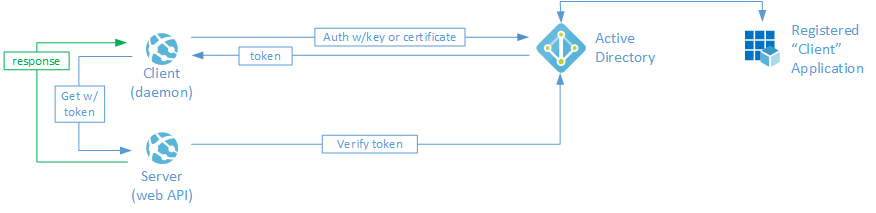
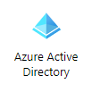
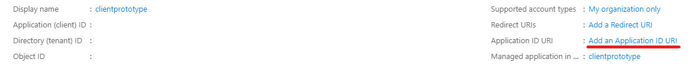
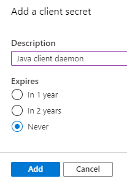
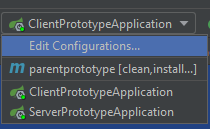
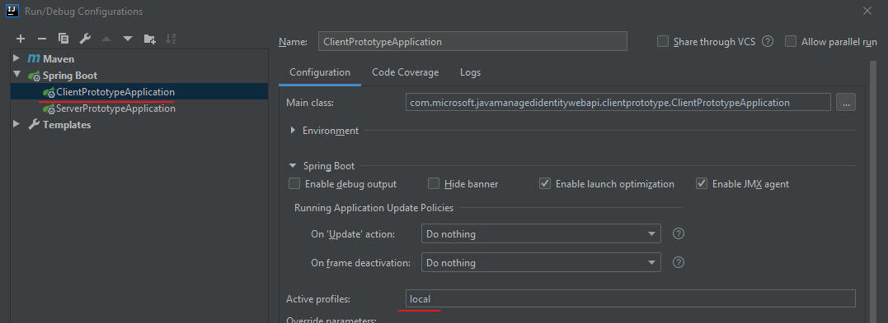

# Using Azure Active Directory and Spring Boot to authenticate a Java service daemon with a protected Java web API

|   [Configuration](#setup-and-configuration)   | [Docker/Azure](DockerConfiguration.md)  |
| ---                       | ---   |

## About this sample

This example provides the necessary code, configuration guidance, and tests associated with calling a protected web API
using the [Java Spring Boot framework](https://spring.io/projects/spring-boot). We use Azure Active Directory as our
authorization server to provide a token to the calling application which passes it to the web server where it is
validated. The web API then either permits or denys the call to the URL.

A common way of providing Azure Active Directory authentication to a web API from a Single Page Application ("SPA") is
to use
[OAuth 2.0 implicit grant flow](https://docs.microsoft.com/en-us/azure/active-directory/develop/v2-oauth2-implicit-grant-flow).
However, what if you needed to authenticate an application running as a service; without a real person providing
credentials? Given this use case, we rely on the
[OAuth 2.0 client credentials grant flow](https://docs.microsoft.com/en-us/azure/active-directory/develop/v2-oauth2-client-creds-grant-flow).

## Scenario

We have the calling application, (the "Client") requesting a JSON Web Token ("JWT") from Azure Active Directory ("AAD").
The Client sends the JWT to the web API (the "Server") where the Server validates it and either permits or denys access
to the requested path.



This flow relies on credentials used by the Client to request the JWT from AAD. The Client's credentials are obtained by
registering its identity in ADD and obtaining a "clientId" and "secret". Combining these two pieces together with
the tenantId, a JSON Web Token ("JWT") is obtained which contains the claims issued by the authorization server; in this
case, AAD. A more detailed explanation of this flow is outlined below.

## Project organization

This project is organized into two modules; the Client and the Server. Since this is a Java project, a root `pom.xml`
defines the parent and subordinate child modules each with their own `pom.xml` files.

### The "Client" (service daemon)

The [clientprototype](https://github.com/jasonshave/JavaClientCredentialFlowWebAPI/tree/master/clientprototype) folder
contains the code for running the Client. The client relies on the Active Directory Client Library for Java,
[ADAL4J](https://github.com/AzureAD/azure-activedirectory-library-for-java) to make the call to AAD in order to get the
JWT. It is the responsibility of the client to perform the following high-level tasks:

- Provide the tenantId, clientId, client secret, and resource URI to AAD
- Receive back a token from the authorization server (AAD)
- Call the web API with the token (JWT)

### The "Server" (web API)

The [serverprototype](https://github.com/jasonshave/JavaClientCredentialFlowWebAPI/tree/master/serverprototype) folder
contains most of the code for this sample as it has significantly more responsibility than the client as follows:

- Filter all HTTP calls and apply necessary security check
- Receive token from the Client
- Parse the token and validate it against AAD
- Permit or deny access to the requested URL

### Secrets and Settings

NOTE: This sample currently uses the `application-local.properties` file for both the serverprototype and
clientprototype modules which has been ignored by Git to store secrets and configuration information.
A future update will include instructions for incorporating Azure Key Vault's secret store.

## Setup and Configuration

The setup of this sample involves the following high-level tasks which are broken down into detailed steps below:

1. Configure the Client in Azure Active Directory.
    - Register and configure the Client application as a **registered application**
    - Create a secret
    - Obtain necessary additional parameters from AAD
2. Configure the `clientprototype` application settings.

### Configure the Client in Azure Active Directory

NOTE: If you don't yet have access to Azure Active Directory, you can obtain a free tenant by
[clicking here](https://azure.microsoft.com/en-ca/free).

1. [Sign into Azure](https://portal.azure.com) and click on the **Azure Active Directory** link.

    

2. Click on **App Registrations**.

    

3. Click **New registration**.

    

4. Type a **Name** for your application (i.e. clientprototype).

5. For the **Supported account types**, leave the default of **Accounts in this organizational directory only (*your tenant name* - Single tenant)**.

    - **NOTE:** This sample was only tested with single tenants in mind. It may work with multi-tenant configurations as well
    however this may require the use of the MSAL4J library instead of ADAL4J.

6. Click the **Register** button.

7. On the summary screen for your newly created application, click the link **Add an Application ID URI**.

    - **NOTE:** The client ID, tenant ID, and object ID have been removed from the image below for security reasons.

    

8. Click the **Set** link, then click **Save** to accept the default application ID URI.

    

9. Click the **Certificates & Secrets** menu item.

    

10. Under the **Client secrets** section click **New client secret**.

    

11. Type a name for the **description** and select an expiration, or set it to never and click **Save**.

    

12. Copy the client secret value somewhere and be sure to keep it outside of your code repository.

    **NOTE:** You will never be able to view this secret again if you navigate away from this page.
    However, you can always delete it and/or create another one.

## Configure the 'clientprototype' application settings

If you are running this application locally on your workstation (i.e. in IntellIJ), follow these steps to configure your
`application-local.properties' file:

1. Under `/clientprototype/src/main/java/resources` create a file called `application-local.properties` and add this file to your `.gitignore`.

2. You will need to gather some information from the previous steps such as:

    - Application ID URI
    - Tenant ID
    - Client ID
    - Client secret

3. To obtain this information, go back to the Azure portal and locate your registered application, then click the **Overview** menu and retrieve the following:

    |   Name    |   Property    | Value | Purpose
    |   ---         | ---   | ---   | ---
    |   Application (client) ID     |   clientId   | *your_client_id*  | Used by ADAL4J client to identify your application
    |   Directory (tenant) ID       |   authority    | *your_tenant_id*  | Used by ADAL4J client to locate your tenant
    |   Application ID URI          |   application-id-uri    | *your_application_id_uri* | Used by ADAL4J client to identify your application

4. In addition to the above values, you will retrieve the following:

    |   Property    | Value | Purpose
    |   ---         | ---   | ---
    |   clientSecret   | *your_client_secret* | Used by ADAL4J to obtain a token from AAD
    |   resource-api-url    | http://localhost:8080/gettime | The URL you will use to test the web API on the "server"

5. In the `application-local.properties` file, populate it as follows:

    ```plaintext
    authority=https://login.microsoftonline.com/*your_tenant_id*/
    application-id-uri=api://*your_application_id_uri*
    resource-api-url=http://localhost:8080/gettime
    clientId=*your_client_id*
    clientSecret=*your_client_secret*
    ```

6. Within IntelliJ click the **Edit Configurations** option on the top navigation bar.

    

7. For the **ClientPrototypeApplication** set the **Active profiles** to "local".

    

At this stage the Client has been configured to talk to Azure Active Directory using the registered application
ID and secret.

## Build and Test

Build both the Client and Server applications and run the Server; you should see the server listening on port 8080. When you run the client it will automatically talk to AAD, obtain a token, pass it to the server's `/gettime` URL. You should see the `Bearer` JWT (token) show up in the console as well.

### Checking your JWT bearer token from Azure AD

1. Navigate to https://jwt.io.

2. Locate your `Bearer` token in the client console window and paste it into the JWT website.

### Verify your URL is protected

1. Navigate to http://localhost:8080/gettime.

2. Currently this will throw an HTTP/500 error.
